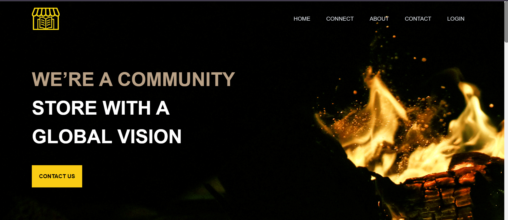
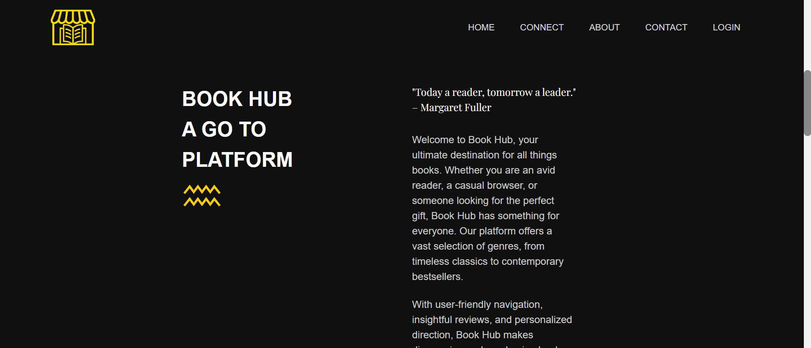
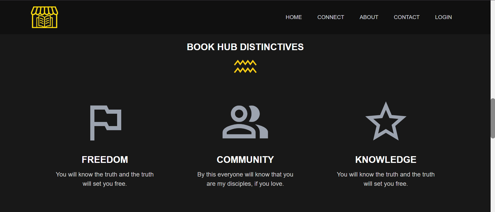
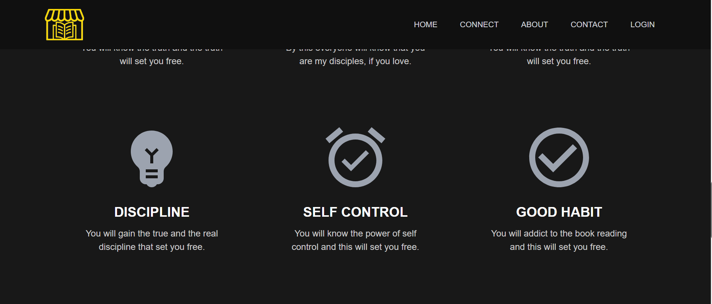
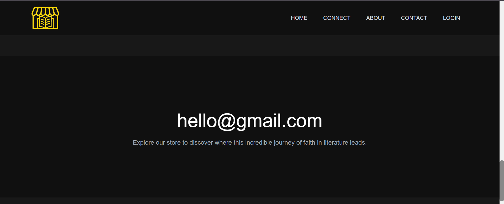
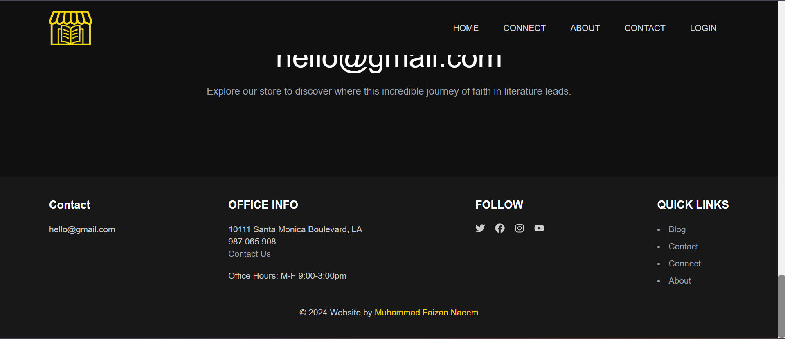
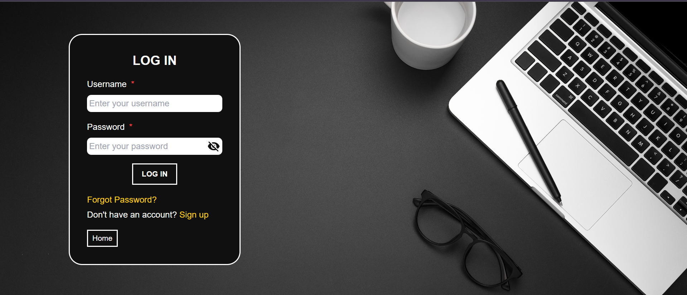
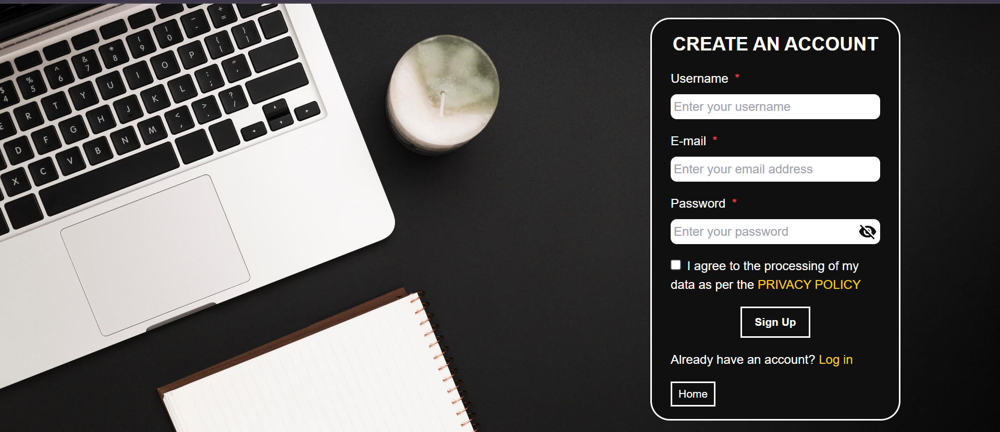

# Dynamic Landing Page AWD Project

## Description

The Dynamic Landing Page AWD Project is a modern and responsive landing page developed using React and Tailwind CSS. This project aims to create an engaging and dynamic user experience by leveraging the latest web development technologies. The landing page is designed to be adaptable, providing a seamless experience across various devices and screen sizes.

The project showcases a range of interactive components and features including a user authentication system, dynamic content loading, and responsive design elements. The integration with backend services ensures that data is securely managed and displayed in real-time, enhancing the overall functionality and user engagement. 

## Project Images

## Available Scripts

In the project directory, you can run:

### `npm start`

Runs the app in the development mode.\
Open [http://localhost:3000](http://localhost:3000) to view it in your browser.

The page will reload when you make changes.\
You may also see any lint errors in the console.

## Learn More

You can learn more in the [Create React App documentation](https://facebook.github.io/create-react-app/docs/getting-started).

To learn React, check out the [React documentation](https://reactjs.org/).